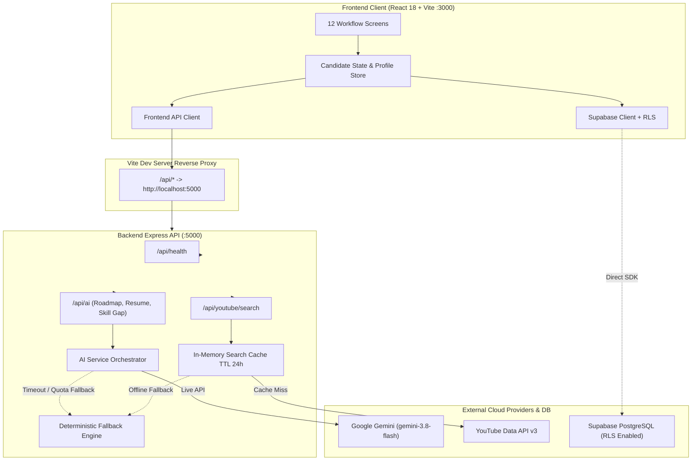
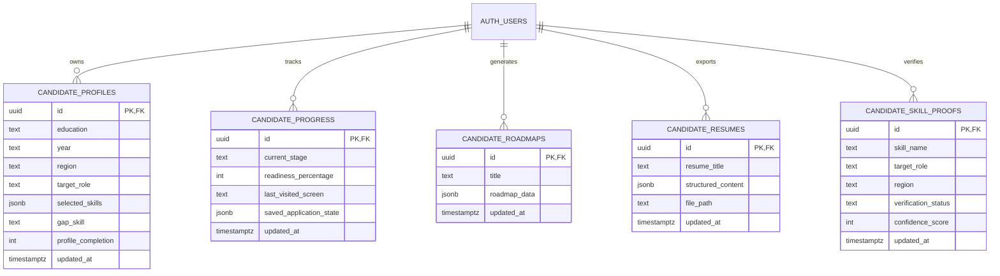

# REGIONAL - AI

**Regional Career Intelligence & ATS Resume Engine for Tier-2/Tier-3 Engineering Candidates**

[](https://react.dev/)
[](https://www.typescriptlang.org/)
[](https://vitejs.dev/)
[](https://expressjs.com/)
[](https://ai.google.dev/)
[](https://developers.google.com/youtube/v3)
[](https://supabase.com/)

---

## Overview

**REGIONAL - AI** bridges the divide between academic curriculum and regional tech industry hiring demands across emerging tech corridors (e.g., Chennai, Coimbatore, Bengaluru, Hyderabad). 

The platform offers an end-to-end guided workflow: candidates analyze real-world hiring trends, identify high-priority skill gaps, follow personalized learning roadmaps, and generate executive-tier, zero-hallucination, ATS-optimized technical resumes verified with hands-on project proof.

## Key Features

- **Candidate Profile & Target Role:** Tailored onboarding capturing student tier, graduation year, target region, and existing technical stack.
- **Regional Market Signals:** Real-time hiring demand indicators, top compensation skills, and demand-velocity scoring across tech hubs.
- **Skill Gap Diagnosis:** Automated differential analysis comparing student proficiencies against live regional employer expectations.
- **Interactive Learning Roadmap:** Stage-by-stage engineering milestones backed by live **YouTube Data API v3** curated video tutorials.
- **Elite ATS Resume Engine:** Powered by **Google Gemini** with strict zero-hallucination constraints, action-oriented bullet points (Google X-Y-Z formula), 3-tier skill categorization, and instant vector-crisp PDF export.
- **Skill Proof & Verification:** Project deliverables, README requirements, and repository checklist verification ensuring candidate authenticity.
- **100% Responsive Design:** Preserves exact pixel fidelity to the reference desktop design (1440×900) while smoothly adapting across all mobile, tablet, and laptop viewports (tested from 320px to 1920px with zero layout overflow).
- **Graceful Deterministic Fallbacks:** Integrated offline engine guarantees full workflow continuity even if external APIs or network connections are unavailable.

## Technology Stack

| Technology | Purpose |
|---|---|
| React 18 | Frontend UI |
| TypeScript | Type-safe frontend and backend code |
| Vite 5 | Frontend development and production build |
| Node.js + Express 4 | Backend API |
| Google Gemini via @google/genai | AI-assisted career workflows |
| YouTube Data API v3 | Learning-resource search |
| Figma | UI/UX design workflow |
| GitHub | Source control and collaboration |

## Architecture & Data Flow



---

## Candidate Journey Flow

The platform guides candidates through an end-to-end 12-screen progression from regional discovery to verified career readiness:

```mermaid
flowchart LR
    A["01. Login"] --> B["02. Onboarding"]
    B --> C["03. Target Role"]
    C --> D["04. Skill Profile"]
    D --> E["05. Regional Signal"]
    E --> F["06. Dashboard"]
    F --> G["07. Skill Intel"]
    G --> H["08. Skill Gap"]
    H --> I["09. Roadmap"]
    I --> J["10. Resume Builder"]
    J --> K["11. Skill Proof"]
    K --> L["12. System QA"]

    classDef screen fill:#F2F0FF,stroke:#5B50E8,stroke-width:2px,color:#17171B;
    class A,B,C,D,E,F,G,H,I,J,K,L screen;
```



### Detailed Screen Workflow:
1. **Login (`#login`):** Authentication entry point with demo session mode and Supabase integration.
2. **Onboarding (`#onboarding`):** Captures college tier, graduation year, and preferred regional work cluster.
3. **Target Role (`#target-role`):** Selects engineering career track (e.g., *Backend Developer*, *Full-Stack Engineer*).
4. **Skill Profile (`#skill-profile`):** Tags verified foundational competencies and optional resume source upload.
5. **Regional Signal (`#regional-signal`):** Analyzes regional industry demand velocity and median compensation benchmarks.
6. **Dashboard (`#dashboard`):** High-level view of candidate readiness, active priority skills, and hiring index.
7. **Skill Intelligence (`#skill-intelligence`):** Deep dive into regional skill demand distributions and employer requirements.
8. **Skill Gap (`#skill-gap`):** Differential diagnosis comparing candidate abilities against market benchmarks.
9. **Roadmap (`#roadmap`):** Stage-by-stage learning milestones integrated with live YouTube learning videos.
10. **Resume Builder (`#resume-builder`):** Generates executive-tier, zero-hallucination ATS resumes with Google X-Y-Z bullet points and vector PDF export.
11. **Skill Proof (`#skill-proof`):** Project deliverables, code requirements, and repository verification checklist.
12. **System QA (`#system-qa`):** Complete prototype auditing, compliance checklists, and system readiness verification.

---

## Database Architecture (Supabase PostgreSQL)

All tables enforce **Row Level Security (RLS)** ensuring candidate isolation (`auth.uid() = id`):



---

## Repository Structure

```
REGIONAL-AI/
├── public/                 # Favicons, web manifest, static SVG assets
├── src/
│   ├── components/         # 12 core responsive workflow screens
│   ├── services/           # apiClient.ts (HTTP client + fallback) & supabaseClient.ts
│   ├── App.tsx             # Main client orchestrator, hash routing & global state
│   ├── index.css           # Design tokens, responsive utilities & media queries
│   └── main.tsx            # React root mount
├── server/
│   ├── src/
│   │   ├── providers/      # Gemini provider (LLM) & YouTube provider
│   │   ├── routes/         # Express endpoints (/api/ai, /api/youtube, /api/health)
│   │   ├── services/       # AI service orchestrator & caching layer
│   │   ├── types/          # Standardized API response types
│   │   └── utils/          # Deterministic fallback engine & input validation
│   ├── package.json        # Server dependencies
│   └── tsconfig.json       # Server TypeScript configuration
├── tests/                  # End-to-end and unit test suites
├── docs/                   # Architectural blueprints & verification reports
├── supabase/               # Database migrations (001-005) & RLS policies
├── package.json            # Root frontend dependencies & scripts
└── vite.config.ts          # Vite build config & proxy to :5000
```

## Requirements

- Node.js LTS and npm
- Google Gemini API key for live AI responses
- Google Cloud API key with YouTube Data API v3 enabled for live video search

Without valid provider credentials, some features may use fallback/demo responses instead of live provider data.

## Local setup

### 1. Clone and install frontend dependencies

    git clone https://github.com/gugan207/REGIONAL-AI.git
    cd REGIONAL-AI
    npm install

### 2. Configure backend environment

In PowerShell, create a private backend environment file:

    Copy-Item server/.env.example server/.env

Edit server/.env and set your real provider credentials. Do not commit this file.

### 3. Install and start the backend

From the repository root:

    cd server
    npm install
    npm run build
    npm start

The backend defaults to port 5000. Keep this terminal running.

### 4. Start the frontend

In a second terminal, from the repository root:

    npm install
    npm run dev

Open http://localhost:3000.

### 5. Check backend health

Visit http://localhost:5000/api/health. This reports backend and provider configuration status; it does not guarantee every provider request will succeed.

## Environment variables

The root and server environment templates document the current backend configuration.

| Variable | Purpose | Default/template |
|---|---|---|
| GEMINI_API_KEY | Gemini API key; server-side only | Empty |
| GEMINI_MODEL | Gemini model identifier | gemini-3.8-flash |
| GEMINI_REQUEST_TIMEOUT_MS | AI request timeout | 30000 |
| YOUTUBE_API_KEY | YouTube Data API key; server-side only | Empty |
| YOUTUBE_API_BASE_URL | YouTube API endpoint | https://www.googleapis.com/youtube/v3 |
| YOUTUBE_CACHE_TTL_SECONDS | Search cache duration | 86400 |
| YOUTUBE_MAX_RESULTS_PER_QUERY | Maximum search results | 10 |
| PORT | Backend port | 5000 |
| NODE_ENV | Runtime environment | development |
| CORS_ORIGIN | Allowed frontend origin(s) | http://localhost:3000 |
| FORCE_DEMO_FALLBACK | Force fallback responses | false |

Keep real credentials in ignored local environment files or your deployment provider's secret manager. Never place backend provider keys in frontend code or commit them.

## API reference

| Method | Endpoint | Purpose |
|---|---|---|
| GET | /api/health | Backend health and sanitized provider status |
| POST | /api/ai/roadmap | Generate a structured career roadmap |
| POST | /api/ai/resume | Structure supplied resume information |
| POST | /api/ai/skill-gap | Explain a target skill gap |
| GET | /api/youtube/search?skill=... | Search learning resources |
| POST | /api/nvidia/roadmap | Legacy route alias to the Gemini-backed AI router |
| POST | /api/nvidia/resume | Legacy route alias to the Gemini-backed AI router |
| POST | /api/nvidia/skill-gap | Legacy route alias to the Gemini-backed AI router |

The legacy /api/nvidia/* URLs do not indicate that NVIDIA is an active AI provider. See server/src/routes/ and server/src/utils/validation.ts for request details.

## Build and testing

Frontend production build, from the repository root:

    npm run build

Backend build, from the repository root:

    cd server
    npm run build

The current package manifests do not define a root test script. Refer to the project reports for additional test commands, and only report checks as passed if they have actually been run.

## Security

- Keep Gemini and YouTube credentials on the backend.
- Do not commit .env, .env.local, server/.env, tokens, or private keys.
- Validate API input and configure CORS for the correct deployment origin.
- If Supabase is enabled, use Row Level Security on exposed private tables and test cross-user access isolation.
- Store private resume files in private storage with user-scoped policies.
- Rotate credentials if they are exposed accidentally.

## Limitations and next steps

- Live provider responses require valid credentials, supported provider configuration, and available quotas.
- Fallback content is not verified live market data.
- Confirm deployed Gemini and YouTube calls, video playback, resume export/download, and responsive behavior in a browser.
- Verify Supabase integration on the deployed branch before advertising real authentication or persistent user records.

## Contributing

1. Create a feature branch.
2. Keep changes focused and preserve the established Figma UI.
3. Never commit credentials.
4. Run applicable frontend and backend build checks.
5. Include actual validation results with pull requests.

## License

Distributed under the MIT License. See LICENSE.
